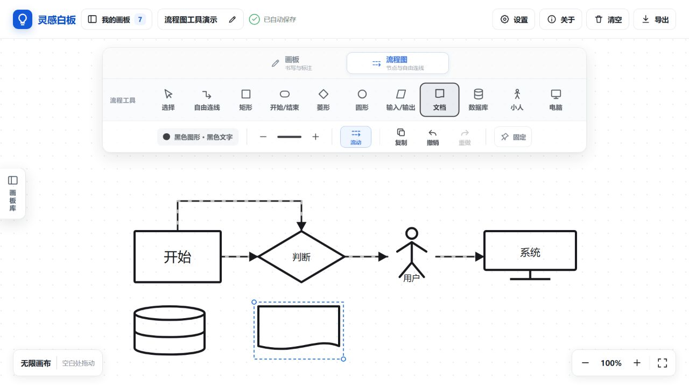
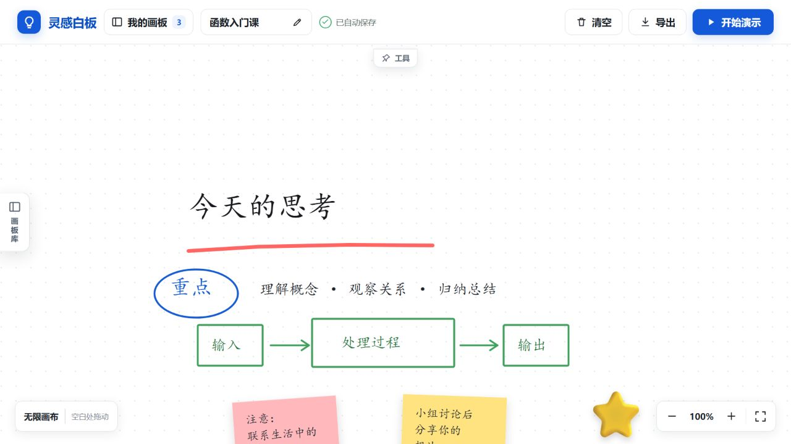
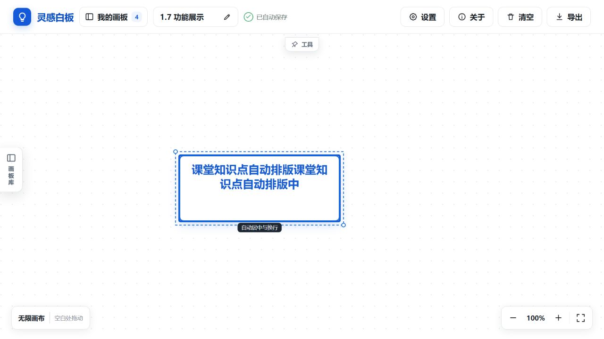
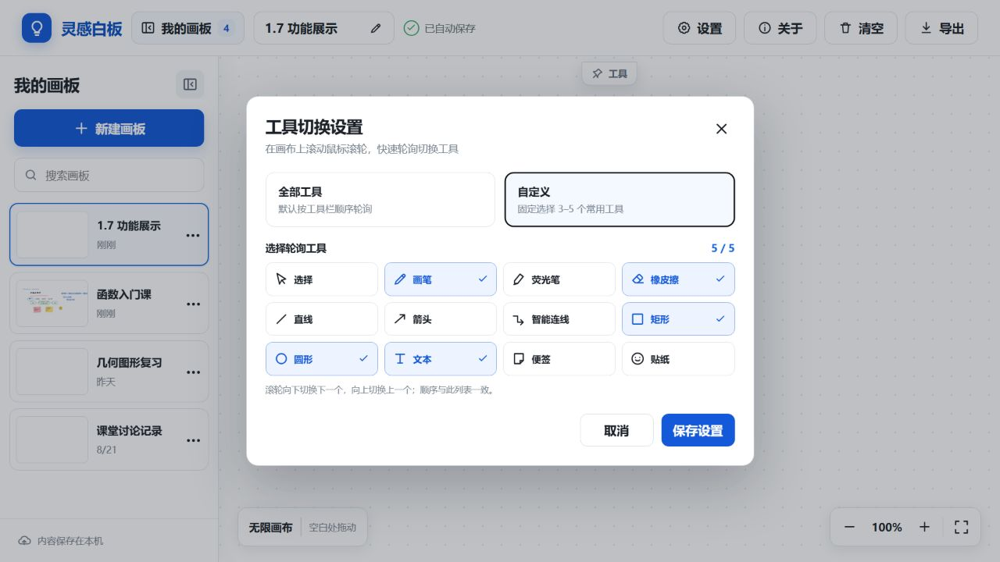
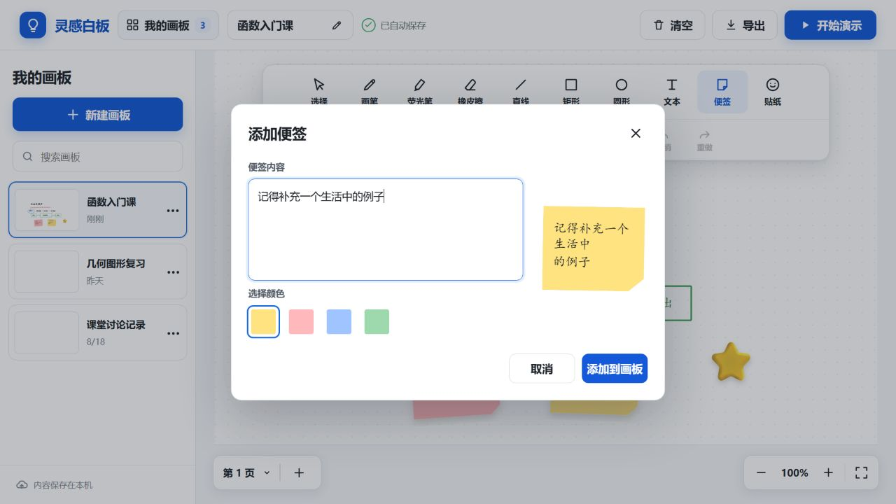

<div align="center">

# ✨ 灵感白板

**一款为课堂讲解、在线教学与随手板书设计的本地桌面白板。**

自由书写、绘制图形、添加便签，并让每一块画板都被自动记住。

[下载安装版](https://github.com/zhangnanydl/linggan-whiteboard/releases/download/v1.7.0/Linggan-Whiteboard-1.7.0-x64-setup.exe) · [下载便携版](https://github.com/zhangnanydl/linggan-whiteboard/releases/download/v1.7.0/Linggan-Whiteboard-1.7.0-x64-portable.exe) · [全部版本](https://github.com/zhangnanydl/linggan-whiteboard/releases) · [报告问题](../../issues)


</div>



## 为什么做灵感白板

教学时，一个顺手的白板不应该让人分心。灵感白板把常用工具集中在画布上方，并提供可持续保存的“画板库”：新建画板不会覆盖旧内容，退出软件后再次打开，课堂笔记仍然在原来的位置。

项目完全在本机运行，不需要注册账号，也不会把白板内容上传到服务器。

## 功能亮点

| 功能 | 说明 |
| --- | --- |
| 🗂️ 记忆画板 | 创建、搜索、切换、重命名和删除多个画板，每块画板独立保存 |
| 🖥️ 无限画布 | 工作区铺满窗口，可向任意方向拖动漫游，画板库可收起并记住状态 |
| 📌 智能工具箱 | 图钉固定后始终显示；未固定时点击画布立即隐藏，悬停立即唤回 |
| 🖱️ 滚轮切换 | 在画布上滚动鼠标滚轮切换工具，默认轮询全部，也可自定义 3–5 个常用工具 |
| ✍️ 自由书写 | 画笔、荧光笔、粗细和多种颜色，适合鼠标与触控书写 |
| 📐 图形工具 | 直线、自由箭头、矩形和圆形，快速完成课堂示意图 |
| 🔗 智能连线 | 点击两个图形自动生成正交折线，移动节点时重新规划，并支持流动动画 |
| 📝 原位文本 | 点击画布直接输入；矩形和圆形内可直接输入并自动居中、换行与缩放 |
| 🎨 贴纸 | 在画布中加入表情贴纸，让重点更加醒目 |
| ↩️ 历史操作 | 支持撤销、重做以及删除当前选中的元素 |
| 🧽 局部擦除 | 自由笔迹只擦掉经过的局部，橡皮范围可放大缩小，整次拖动支持一步撤销 |
| 🔍 画布控制 | 40%–250% 缩放、回到原点和空白处拖动画布 |
| 🖼️ PNG 导出 | 将当前画板导出为以画板名称命名的 PNG 图片 |
| 🔒 本地优先 | 内容自动保存在当前设备浏览器存储中，不依赖云服务 |

## 下载与安装

### Windows 安装版

从 [GitHub Releases 下载灵感白板-1.7.0 安装版](https://github.com/zhangnanydl/linggan-whiteboard/releases/download/v1.7.0/Linggan-Whiteboard-1.7.0-x64-setup.exe)，双击后可选择安装目录。安装程序会创建桌面和开始菜单快捷方式。

### Windows 便携版

从 [GitHub Releases 下载灵感白板-1.7.0 便携版](https://github.com/zhangnanydl/linggan-whiteboard/releases/download/v1.7.0/Linggan-Whiteboard-1.7.0-x64-portable.exe)，无需安装即可运行，适合放入 U 盘或教学电脑。

> 当前发行文件尚未购买代码签名证书。Windows 首次运行时可能显示 SmartScreen 提示，请核对文件来源后选择“更多信息 → 仍要运行”。

## 快速上手

1. 点击左侧 **新建画板**，输入课程或主题名称。
2. 在顶部工具栏选择画笔、图形、文本、便签或贴纸。
3. 直接在点阵画布上书写或拖动绘制。
4. 点击左侧其他画板即可切换，当前内容会自动保存。
5. 需要分享时点击右上角 **导出**，保存为 PNG 图片。

### 常用操作

| 操作 | 方法 |
| --- | --- |
| 选择元素 | 选择“选择”工具后点击元素 |
| 拖动画布 | 选择工具下拖动空白处，或按住空格键/鼠标中键拖动 |
| 输入画布文字 | 选择“文本”后点击空白处，直接输入，`Ctrl + Enter` 完成 |
| 输入图形文字 | 选择“文本”后点击矩形或圆形，文字自动居中排版 |
| 再次编辑 | 使用“选择”双击文字、矩形、圆形或便签 |
| 调节橡皮 | 选择“橡皮擦”后用工具箱的减号、加号调节擦除范围 |
| 滚轮切换工具 | 鼠标位于画布时，向下滚动切换下一个工具，向上滚动返回上一个 |
| 创建智能连线 | 选择“智能连线”，依次点击起点图形和终点图形 |
| 切换流动效果 | 选中智能连线后点击工具箱中的“流动”按钮 |
| 删除元素 | 选中元素后按 `Delete` 或 `Backspace` |
| 撤销 | `Ctrl + Z` |
| 重做 | `Ctrl + Shift + Z` |
| 取消选择/关闭面板 | `Esc` |

## 作者与开源

- 作者：**张楠**
- GitHub：[@zhangnanydl](https://github.com/zhangnanydl)
- 项目仓库：[zhangnanydl/linggan-whiteboard](https://github.com/zhangnanydl/linggan-whiteboard)

应用顶部的 **关于** 按钮也可随时查看作者、版本与开源仓库信息。

## 沉浸式工具箱

工具箱右下方的图钉用于控制显示方式：

- **固定**：工具箱持续显示，点击画布也不会收起，适合频繁切换工具。
- **未固定**：点击画布立即收起；离开工具箱 5 秒也会自动收起。
- **重新显示**：将鼠标移入顶部中央的“工具”标签，或者通过键盘聚焦并激活该标签。

隐藏后，画布上方不再被工具箱遮挡，适合连续书写和课堂展示。



## 原位文字与图形排版

选择“文本”后，无论点击画布空白处还是矩形、圆形，都可以在当前位置直接输入，不再弹出文字窗口。图形内文字会根据可用空间自动居中、换行并缩放；使用选择工具双击即可再次编辑。



## 滚轮工具轮询

鼠标位于画布时滚动滚轮即可快速切换工具。默认按工具栏顺序轮询全部 12 个工具；在“设置 → 工具切换设置”中切换为自定义模式后，可固定选择 3–5 个常用工具。配置自动保存在本机。



## 便签编辑器

便签使用白板自己的弹窗，不再依赖浏览器输入框。输入内容、选择颜色时可以即时查看效果。



## 数据保存与隐私

- 所有画板数据均保存在本机的 `localStorage` 中。
- 应用不包含账户、统计、广告、遥测或远程上传功能。
- 安装版与便携版在同一 Windows 用户环境中运行时使用 Electron 的应用数据目录。
- 卸载软件、清理应用数据或更换电脑前，请先将重要画板导出为 PNG。
- 当前版本没有云同步和画板文件导入功能。

## 本地开发

### 环境要求

- Windows 10/11（桌面应用打包目标）
- Node.js 20 或更高版本
- npm 10 或更高版本

### 启动开发环境

```powershell
git clone <你的仓库地址>
cd whiteboard
npm install
npm run dev
```

浏览器访问终端显示的本地地址即可。若要以 Electron 桌面窗口运行：

```powershell
npm run desktop
```

### 构建前端

```powershell
npm run build
```

构建产物生成在 `dist/`。

## 一键打包 Windows EXE

项目提供了 [一键打包.ps1](./一键打包.ps1)，会自动安装依赖、构建前端，并生成安装版与便携版。

```powershell
Set-ExecutionPolicy -Scope Process Bypass
.\一键打包.ps1
```

依赖已经安装时，可跳过安装步骤：

```powershell
.\一键打包.ps1 -SkipInstall
```

不需要自动打开输出目录时：

```powershell
.\一键打包.ps1 -NoOpenFolder
```

输出文件位于 `release/`。脚本为国内网络配置了 npm、Electron 与 electron-builder 镜像。

## 技术栈

- [React 19](https://react.dev/)：界面与状态管理
- [Vite 7](https://vite.dev/)：开发服务器与前端构建
- SVG：画布渲染、图形和自由笔迹
- [Electron 40](https://www.electronjs.org/)：Windows 桌面应用
- [electron-builder](https://www.electron.build/)：NSIS 安装包与便携版构建

## 项目结构

```text
whiteboard/
├─ docs/images/          # README 实际运行截图
├─ design/               # 产品设计概念稿
├─ electron/main.cjs     # Electron 主进程与安全配置
├─ release/              # 本地打包输出（已忽略；EXE 发布到 GitHub Releases）
├─ src/main.jsx          # 白板功能、画板存储和交互
├─ src/styles.css        # 产品界面样式
├─ index.html            # Vite 入口页面
├─ package.json          # 项目元数据与构建配置
└─ 一键打包.ps1          # Windows 一键打包脚本
```

## 路线图

- [ ] 画板文件导入、导出与备份
- [ ] 多页面画板
- [ ] 图片插入与剪贴板粘贴
- [ ] 更多画笔样式和几何图形
- [ ] 可选的课堂背景模板
- [ ] macOS 与 Linux 构建
- [ ] 自动化测试和代码签名发行流程

路线图不是承诺的发布日期。欢迎在 Issues 中提出使用场景与改进建议。

## 参与贡献

欢迎提交 Bug、功能建议、文档改进或代码贡献。开始前请阅读 [贡献指南](./CONTRIBUTING.md) 与 [行为准则](./CODE_OF_CONDUCT.md)。安全问题请按 [安全策略](./SECURITY.md) 私下报告。

## 开源许可

本项目采用 [MIT License](./LICENSE) 开源。你可以自由使用、修改和分发，但请保留原始版权和许可声明。

---

<div align="center">
如果灵感白板对你的课堂有帮助，欢迎点亮 ⭐ Star。
</div>
